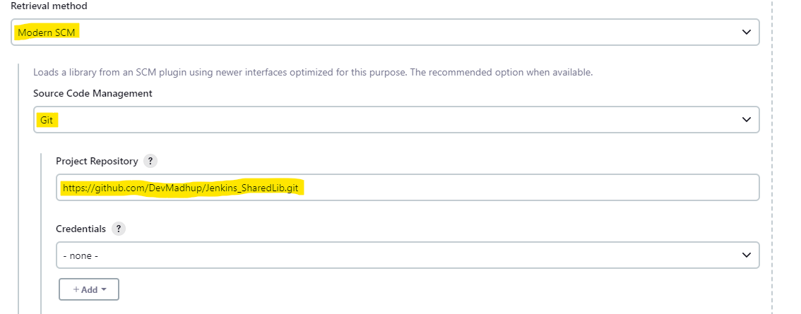

# Jenkins Shared Library

A reusable **Jenkins Shared Library** containing ready-made Groovy pipeline steps for the most common CI/CD tasks — code checkout, Docker build/push/cleanup, SonarQube code quality, OWASP dependency scanning, and Trivy vulnerability scanning.

Instead of copy-pasting the same `sh` steps into every `Jenkinsfile`, import this library and call one-line functions like `docker_build()` or `trivy_scan()`.

---

## 📌 What is a Jenkins Shared Library?

A Shared Library is a Groovy-based, version-controlled collection of pipeline logic that can be imported into any number of Jenkinsfiles across any number of jobs.

**Rules Jenkins expects:**
- Reusable steps live inside the **`vars/`** directory.
- Each step is a single **`.groovy`** file.
- The filename becomes the step's callable name (e.g. `docker_build.groovy` → `docker_build()`).
- Each file defines a `call()` method — this is the entry point Jenkins invokes.

### Why use one (advantages)
| Benefit | Description |
|---|---|
| **DRY pipelines** | Write a build/scan/push step once, reuse it in every project. |
| **Centralized maintenance** | Fix a bug or update a tool version in one file — every pipeline that uses it benefits immediately. |
| **Consistency & governance** | Enforces the same build, security-scan, and deployment standards org-wide. |
| **Faster Jenkinsfiles** | Pipelines shrink from 100+ lines of `sh` steps to a handful of readable function calls. |
| **Version control for pipeline logic** | Tag/branch the library so teams can pin to a stable version (`@v1.0.0`) while others test `@main`. |

---

## 📂 Repository Structure

```
Jennkins_shared_Library/
├── vars/
│   ├── code_checkout.groovy          # Git clone / checkout
│   ├── docker_build.groovy           # Build a Docker image
│   ├── docker_push.groovy            # Login + push image to Docker Hub
│   ├── docker_cleanup.groovy         # Remove a local image
│   ├── docker_compose.groovy         # docker-compose down/up
│   ├── sonarqube_analysis.groovy     # Run SonarQube scan
│   ├── sonarqube_code_quality.groovy # Enforce SonarQube quality gate
│   ├── owasp_dependency.groovy       # OWASP Dependency-Check scan
│   └── trivy_scan.groovy             # Trivy filesystem vulnerability scan
├── assests/                          # Screenshots used in this README
└── README.md
```

---

## 🧩 Available Steps — What, When & Why

### 1. `code_checkout(GitUrl, GitBranch)`
```groovy
code_checkout('https://github.com/your-org/your-repo.git', 'main')
```
- **Does:** Clones the given branch of a Git repo.
- **When to use:** First stage of virtually every pipeline, to pull application source code.
- **Advantage:** One line instead of a full `git url:`/`branch:` block; branch/URL become simple parameters you can drive from a Jenkins Multibranch/parameterized job.

### 2. `docker_build(ProjectName, ImageTag, DockerHubUser)`
```groovy
docker_build('my-app', "${BUILD_NUMBER}", 'mydockerhubuser')
```
- **Does:** Runs `docker build -t <user>/<project>:<tag> .`
- **When to use:** After code checkout, once a `Dockerfile` exists at the repo root, to package the app into an image.
- **Advantage:** Standardizes image naming (`user/project:tag`) across all projects so downstream steps (push, scan, deploy) can rely on a predictable tag.

### 3. `docker_push(Project, ImageTag, dockerhubuser)`
```groovy
docker_push('my-app', "${BUILD_NUMBER}", 'mydockerhubuser')
```
- **Does:** Logs in to Docker Hub using a Jenkins credential and pushes the built image.
- **When to use:** Right after `docker_build`, when the image needs to be published to a registry for deployment.
- **Advantage:** Keeps Docker Hub credentials out of the Jenkinsfile entirely — they're injected securely via Jenkins Credentials.
- **Requires:** A Jenkins **Username/Password** credential with ID **`Docker`** (Docker Hub username + access token/password).
- ⚠️ **Note:** The credential's `usernameVariable` is also named `dockerhubuser`, the same as the function parameter — keep the parameter you pass in sync with the actual Docker Hub username stored in the credential to avoid confusion.

### 4. `docker_cleanup(Project, ImageTag, DockerHubUser)`
```groovy
docker_cleanup('my-app', "${BUILD_NUMBER}", 'mydockerhubuser')
```
- **Does:** Removes the local image (`docker rmi`) after it's been pushed.
- **When to use:** End of pipeline, to keep the Jenkins agent's disk from filling up with old images.
- **Advantage:** Prevents disk-space failures on long-running Jenkins agents without manual housekeeping.

### 5. `docker_compose()`
```groovy
docker_compose()
```
- **Does:** Runs `docker-compose down && docker-compose up -d`.
- **When to use:** For projects that deploy via `docker-compose` (e.g. staging/demo environments) rather than a single container.
- **Advantage:** One call restarts a full multi-container stack cleanly, avoiding "container already exists" conflicts.

### 6. `sonarqube_analysis(SonarQubeAPI, Projectname, ProjectKey)`
```groovy
sonarqube_analysis('sonar-server', 'my-app', 'my-app-key')
```
- **Does:** Runs `sonar-scanner` inside the configured SonarQube environment.
- **When to use:** After build/test, to statically analyze code for bugs, code smells, and security hotspots.
- **Advantage:** Static analysis becomes a reusable, parameterized step instead of duplicated scanner CLI flags in every Jenkinsfile.
- **Requires:** A SonarQube server configured in **Manage Jenkins → System → SonarQube servers**, and the SonarQube Scanner tool installed (`$SONAR_HOME`).

### 7. `sonarqube_code_quality()`
```groovy
sonarqube_code_quality()
```
- **Does:** Waits (up to 1 minute) for the SonarQube Quality Gate result.
- **When to use:** Immediately after `sonarqube_analysis`, to gate the pipeline on code-quality standards.
- **Advantage:** Fails fast on quality regressions; `abortPipeline` can be flipped to `true` to hard-block bad code from progressing.

### 8. `owasp_dependency()`
```groovy
owasp_dependency()
```
- **Does:** Runs OWASP Dependency-Check against the workspace and publishes the XML report.
- **When to use:** To catch known-vulnerable open-source dependencies (CVEs) before deployment.
- **Advantage:** Shifts dependency-vulnerability detection left, into CI, instead of finding out in production.
- **Requires:** The **OWASP Dependency-Check** Jenkins plugin/tool named `OWASP`, and a **secret text** credential with ID **`Nvidia`** containing your NVD API key.

### 9. `trivy_scan()`
```groovy
trivy_scan()
```
- **Does:** Runs `trivy fs .` — a filesystem/dependency vulnerability scan.
- **When to use:** Alongside or instead of OWASP Dependency-Check, or to scan the built Docker image/filesystem for OS + library CVEs.
- **Advantage:** Lightweight, fast, and also capable of scanning container images — good complementary layer to SonarQube (code quality) + OWASP (dependency CVEs).
- **Requires:** Trivy installed on the Jenkins agent.

---

## ⚙️ How to Add This Shared Library in Jenkins

### Step 1 — Register the library globally
1. Go to **Manage Jenkins → System**.
2. Scroll to **Global Trusted Pipeline Libraries** (or **Global Pipeline Libraries**, depending on Jenkins version).
3. Click **Add** and fill in:

   | Field | Value |
   |---|---|
   | Name | `Shared` (or any name you'll reference in `@Library`) |
   | Default version | `main` (or a tag/branch you want as default) |
   | Retrieval method | Modern SCM |
   | Source Code Management | Git |
   | Project Repository | `https://github.com/Ibrahim-Naseef/Jennkins_shared_Library.git` |
   | Credentials | Add if the repo is private |

   
   

4. Click **Save**.

> 💡 Prefer a **folder-level library** if only a subset of jobs should use it: open the folder → **Configure** → **Pipeline Libraries** → add the same details there instead of globally.

### Step 2 — Use it in a Jenkinsfile
Add this as the **first line** of your declarative pipeline:

```groovy
@Library('Shared') _

pipeline {
    agent any

    stages {
        stage('Checkout') {
            steps {
                code_checkout('https://github.com/your-org/your-repo.git', 'main')
            }
        }
        stage('Build') {
            steps {
                docker_build('my-app', "${BUILD_NUMBER}", 'mydockerhubuser')
            }
        }
        stage('SonarQube Analysis') {
            steps {
                sonarqube_analysis('sonar-server', 'my-app', 'my-app-key')
            }
        }
        stage('Quality Gate') {
            steps {
                sonarqube_code_quality()
            }
        }
        stage('OWASP Scan') {
            steps {
                owasp_dependency()
            }
        }
        stage('Trivy Scan') {
            steps {
                trivy_scan()
            }
        }
        stage('Push Image') {
            steps {
                docker_push('my-app', "${BUILD_NUMBER}", 'mydockerhubuser')
            }
        }
        stage('Cleanup') {
            steps {
                docker_cleanup('my-app', "${BUILD_NUMBER}", 'mydockerhubuser')
            }
        }
    }
}
```


**Other ways to load it:**
```groovy
@Library('Shared@main') _              // pin to a branch/tag
@Library(['Shared', 'other-lib']) _    // load multiple libraries

// or load dynamically at runtime, without @Library:
def shared = library('Shared@main')
```

> ⚠️ If **Load implicitly** is unchecked when you register the library, every Jenkinsfile **must** start with `@Library('Shared') _`. If it's checked, all pipelines get it automatically without declaring it.

---

## 🔐 Required Jenkins Credentials & Tools

| ID / Tool | Type | Used by |
|---|---|---|
| `Docker` | Username/Password credential | `docker_push` |
| `Nvidia` | Secret text (NVD API key) | `owasp_dependency` |
| `OWASP` | Tool installation (Dependency-Check) | `owasp_dependency` |
| SonarQube server (e.g. `sonar-server`) | Manage Jenkins → System | `sonarqube_analysis` |
| `trivy` CLI | Installed on agent | `trivy_scan` |
| `docker` / `docker-compose` CLI | Installed on agent | `docker_build`, `docker_push`, `docker_cleanup`, `docker_compose` |

---

## 📝 Notes & Suggestions
- In `docker_push.groovy`, the incoming parameter and the credential's `usernameVariable` share the name `dockerhubuser` — double check the value passed in matches the Docker Hub username tied to the `Docker` credential to avoid confusion.
- Consider pinning `@Library('Shared@<tag>')` to a released tag in production pipelines rather than `main`, so library changes don't silently break live pipelines.
